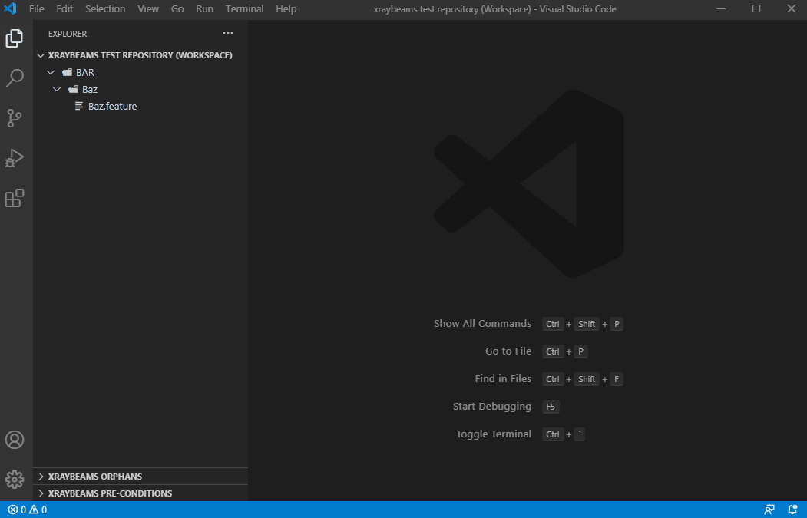
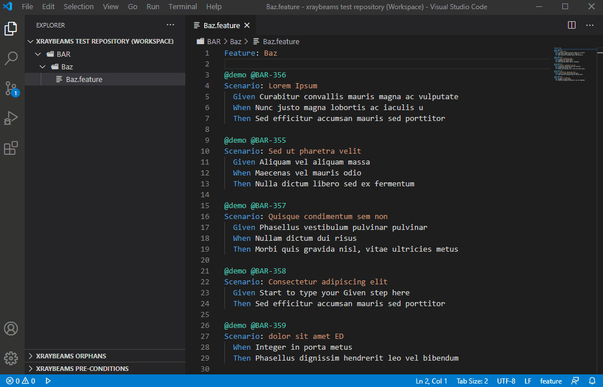
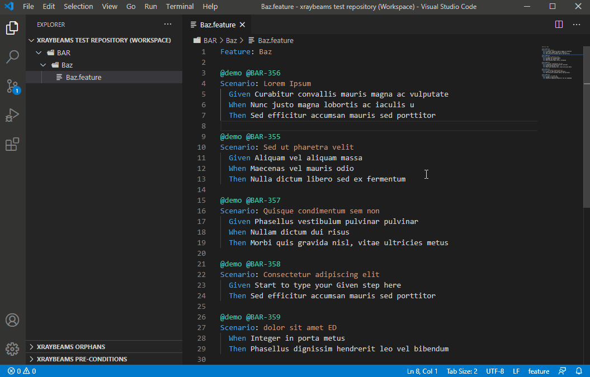
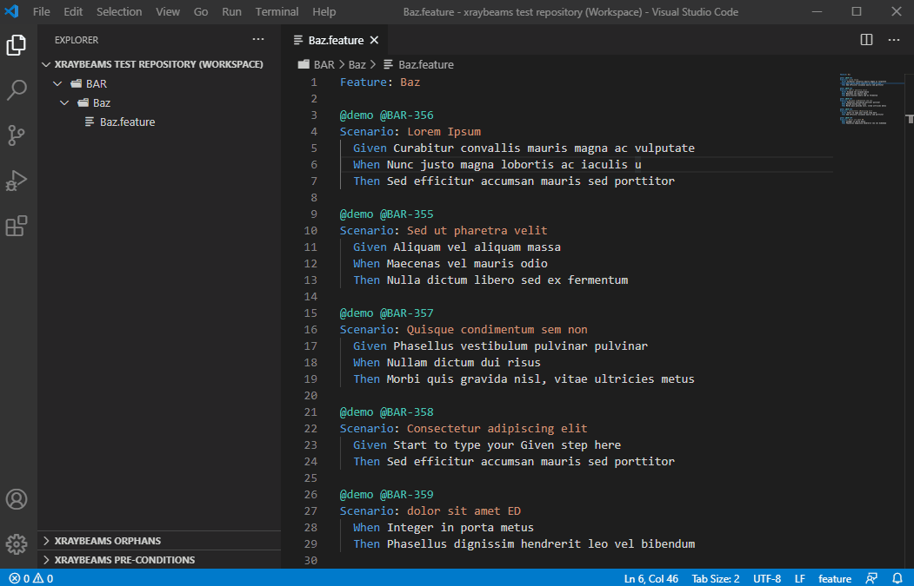
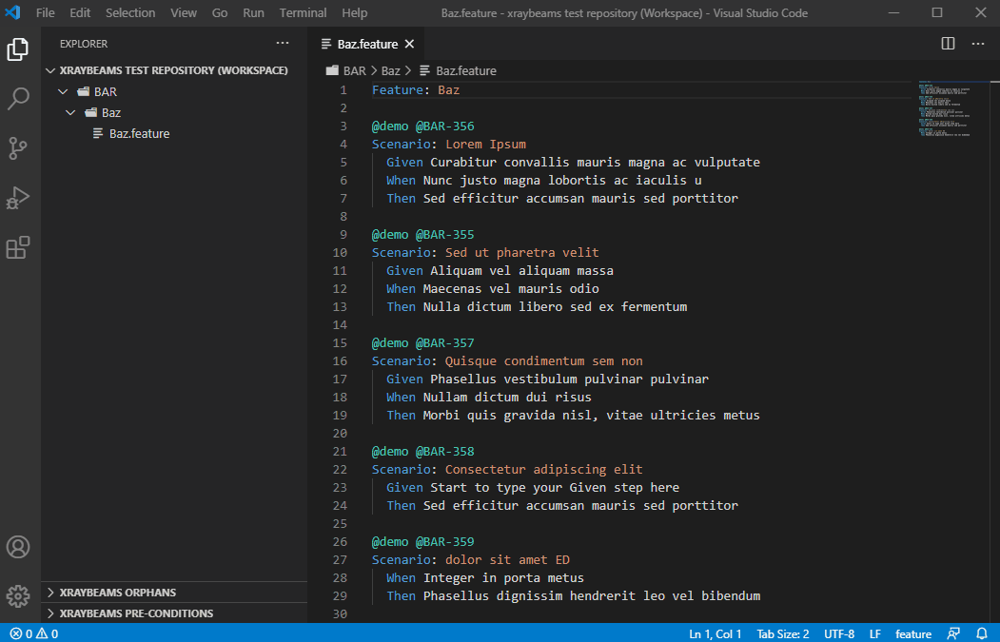

[](https://github.com/danzelbel/xray-beams/blob/master/LICENSE)
[](https://marketplace.visualstudio.com/items?itemName=danzelbel.xray-beams)


# Xray Beams

Xray test management integration for vscode


## Set up workspace

1. Open a new instance of vscode
1. Create a new file and the add ff lines:<br/><br/>
   ```json
   {
     "folders": [
       {
         "name": "{{YOUR_PROJECT_KEY}}",
         "uri": "xbfs:/"
       }
     ],
     "settings": {
       "xrayBeams.jira.baseUrl": "{{YOUR_BASE_URL}}",
       "xrayBeams.jira.projectKey": "{{YOUR_PROJECT_KEY}}",
       "xrayBeams.jira.username": "{{YOUR_USERNAME}}",
       "xrayBeams.jira.jql.orphans": "",
       "xrayBeams.jira.jql.preConditions": "",
       "editor.detectIndentation": true,
       "editor.tabSize": 2
     }
   }
   ```
   ⚠ _Make sure to at least supply the required extension settings._<br/><br/>
1. Save the file as `xraybeams test repository.code-workspace`
1. Open the workspace file in vscode anytime you need to work on your Xray project.

**Working on multiple Xray projects?**

Simply create another workspace file for each Xray project and open them as separate instances of vscode.

Xray Beams can only work on one Xray project per vscode instance. This is by design in order to allow the user to focus on a specific Xray project and to limit the number of views present in the explorer.

⚠ _Workspace file allows you to add more than one folder. Please limit it to one folder only._

## Features

### Manage Xray folders

Create, rename, move or delete Xray folders.


### View tests as feature scenarios

An arbitrary feature file will be created along with the Xray folders so that you will be able to view the associated Xray tests as feature scenarios.



### Manage tests

Add, move or delete tests.



### View Orphans

View and add orphaned tests to feature files.



### View Pre-Conditions

View and add pre-conditions to feature files.



🛈 A `folderId:{{folderId}}` label will be added/removed from the pre-condition when it gets associated/dissociated to an Xray folder.

### Detect feature problems

Notifies you if your feature files are malformed and prevents you from committing these changes.



## Extension Settings

This extension contributes the following settings:

Required
- `xrayBeams.jira.baseUrl`
- `xrayBeams.jira.projectKey`
- `xrayBeams.jira.username`

Optional
- `xrayBeams.jira.jql.orphans`: The Orphans "JQL Search" filter
- `xrayBeams.jira.jql.preConditions`: The Additional jql filter for pre-conditions